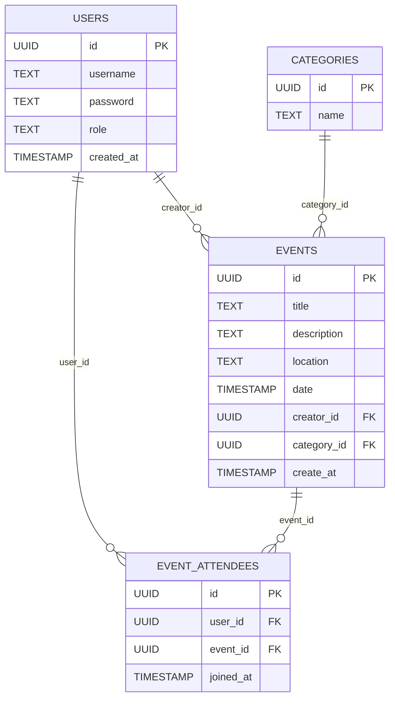

# 🌿 Outside Together

### 🚲 Stay Active. Meet People.

## 📝 30 Second Elevator Pitch

Outside Together is a social activity web app that helps users discover, create, and join outdoor events like hiking trips, pickup games, and longboarding meetups. Built using the PERN stack (PostgreSQL, Express, React, Node.js), the app connects people through shared interests while making it easy to organize events, track attendees, and manage activity details -- perfect for anyone looking to stay active and meet new people.

---

## Core MVP Features

These features define the minimum functional version of Outside Together.

### 👤 User Authenication
* Register new users
* Login/logout with JWT
* Basic profile (username)
* Protected routes

### 🏕️ Event Creation
Users can create events with:
* Title
* Description
* Category
* Location
* Date & time
* Creator

### 🔎 Browse & Discover Events
* View all upcoming events
* Filter by category
* Search events
* View event details

### 🤝 Join / Leave Events
* Join an event
* Leave an event
* View attendee list
* Prevent duplication joins

### 📊 User Dashboard
Users can: 
* View created events
* View joined events
* Manage their events
* Navigate to event details


## 🌟 Stretch Goal Features
These improve usability and polish.

### 🧠 Smart Discovery
* Filter by skill level
* Tag-based search 
* Popular events section

### 📱 UI Improvements
* Mobile responsive layout
* Modern dashboard UI
* Toast notifications

### 🗺️ Location Features 
* Map integration 
* Location-based search
* Distance filtering

### 👥 Social Features
* Save/favorite events
* Event comments
* User avatars

### 🛠️ Admin Controls
* Delete events
* Manage users
* Moderate catergories

---

## 🗃️ Database Design (MVP)


---

## 🔌 Possible API Endpoints

### Auth
* `POST /api/auth/register` - Register a new user
* `POST /api/auth/login` - Authenticate user

### Users
* `GET /api/users/:id` - Get user profile
* `GET /api/users` - Get all users

### Events
* `POST /api/events` - Create a new event
* `GET /api/events` - Get all upcoming events
* `GET /api/events/:id` - Get single event details 
* `PUT /api/events/:id` - Update an event (creator only)
* `DELETE /api/events/:id` - Delete an event (creator/admin only)

### Event Attendees
* `POST /api/events/:id/join` - Join an event
* `DELETE /api/events/:id/leave` - Leave an event
* `GET /api/events/:id/attendees` - Get all attendees for an event

### Categories
* `GET /api/categories` - Get all event categories
* `GET /api/categories/:id/events` - Get events by category

### Dashboard
* `GET /api/dashboard` - Get current user's dashboard data (GET created events + joined events)

### Admin (Stretch)
* `GET /api/admin/users` - Get all users
* `DELETE /api/admin/events/:id` - Delete any event
* `DELETE /api/admin/users/:id` - Delete any user

---

## 🧩 Wireframes

```
/wireframes/
  ├── home.png
  ├── dashboard.png
  ├── create-event.png
  └── event-details.png
```

### 🏡 Home / Discover 
* Navbar
* Category filter
* Search bar
* Event cards grid
* Join button 
* Login button

### 👤 Dashboard
* My Created Events
* Joined Events
* Edit/Delete buttons

### ➕ Create Event 
* Title input
* Description
* Category dropdown
* Location
* Date picker
* Submit button

### 📍 Event Details
* Title
* Description
* Location 
* Date
* Attendees
* Join / Leave button

### 🔐 Login / Register
* Username
* Password
* Submit button

---

## 🪛 Installation & Setup

```bash
# Clone the repo 
git clone https://github.com/your-username/your-repo-name.git

# Navigate into project 
cd your-repo-name

# Install backend dependencies
cd server && npm install

# Install frontend dependencies 
cd ../client && npm install

# Run development servers
npm run dev
```

---


## ⚙️ Tech Stack

### Frontend
* React
* Vite

### Backend
* Node.js
* Express

### Database
* PostgreSQL 
* pg

### Other
* JWT Authentication
* REST API
* Protected routes

---

## 🔮 Future Improvements

* Real-time chat between attendees
* Notifications for joined events
* Google Maps integration
* Weather preview for outdoor events
* Group event planning
* Mobile app version


---

## 👩‍💻 Author

Built by Kiana Mills
<br>
GitHub: [https://github.com/kianamills20](https://github.com/kianamills20)
<br>
Full Stack Developer - Capstone Project 🌸